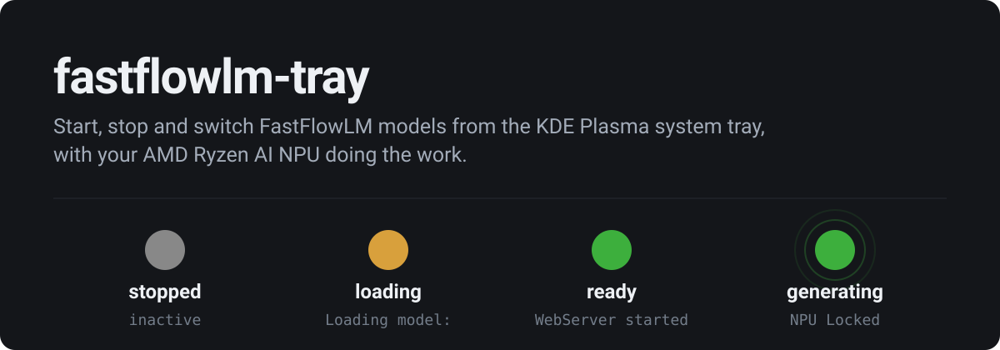
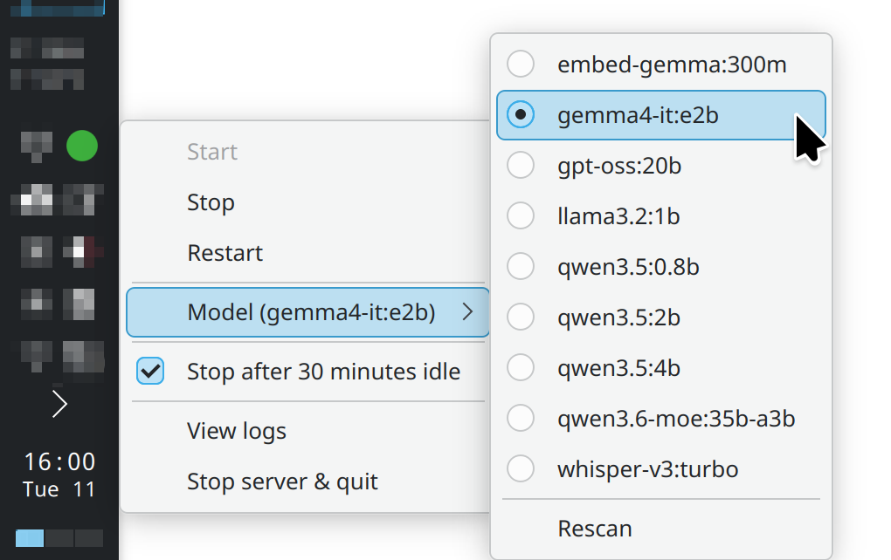
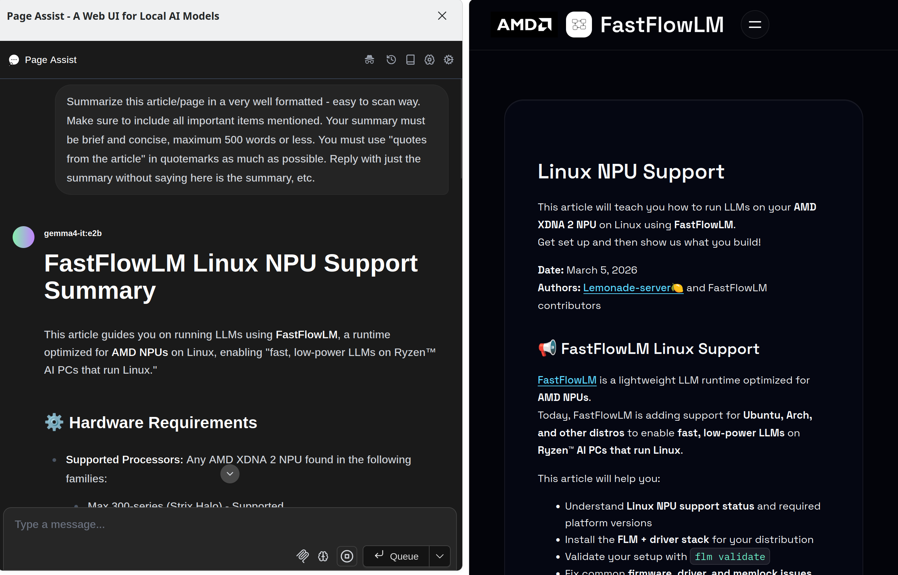

# fastflowlm-tray

Start, stop and switch [FastFlowLM](https://fastflowlm.com) models from the KDE Plasma system tray, with your AMD Ryzen AI NPU doing the work.



## What it is

`flm serve` is a good local LLM server and an awkward thing to babysit. This puts it behind a coloured dot: one click to start it, one submenu to switch models, and the dot tells you whether the NPU is idle, pulling weights into memory, or generating.

The tray does not run the server. A systemd user unit does, and the tray sends it `systemctl --user` verbs while reading the journal for progress.

## Why it is a systemd unit and not a child process

NPU inference locks its weights in memory. A tray app that spawns `flm serve` as a child hands it whatever memlock limit PAM gave your desktop session, and a 20 GB model then fails at load time with an error that points nowhere useful. The unit sets `LimitMEMLOCK=infinity`, and that whole class of failure goes away.

Two smaller things come with it. Logs go to journald rather than a file the tray truncates on every start, which matters because the run you want to read is the one that just crashed. And `Restart=on-failure` covers a crash whether or not you were watching.

## Install

You need FastFlowLM, a systemd user session, and PyQt6 from your distribution's packages.

```bash
git clone https://github.com/amerkay/fastflowlm-tray
cd fastflowlm-tray
./install.sh
```

`install.sh` locates your `flm` binary, writes the unit to `~/.config/systemd/user/flm.service`, and installs the same desktop entry twice: to `~/.config/autostart/` so the tray returns after you log in, and to `~/.local/share/applications/` so it also appears in your application menu. It does not enable the unit. Nothing loads a 20 GB model until you ask it to.

Both entries carry the repository path in their `Exec` line, so re-run `install.sh` if you move this directory.

Start the tray for this session:

```bash
/usr/bin/python3 flm_tray.py &
```

The absolute interpreter path is deliberate. PyQt6 is a system package, so a `python3` shadowed by conda or a venv will not find it.

## Using it

Right click the dot for Start, Stop, Restart, the model list and the log viewer. Left click opens the journal in a terminal, middle click restarts.

The server shuts down when you quit the tray, and after thirty minutes with no request. A loaded model holds around 20 GB, which is a lot to leave sitting idle. Untick "Stop after 30 minutes idle" if you would rather keep it warm; the choice is remembered.

## Pairing it with Page Assist



[Page Assist](https://github.com/n4ze3m/page-assist) is a browser sidebar for local models, and it is what makes this setup worth keeping around. Add `http://localhost:52625/v1` as an OpenAI-compatible provider and your downloaded models show up in its picker.

One thing to know: FastFlowLM loads models on demand, so whichever model Page Assist asks for is the one that gets loaded. The tray's model choice only decides which one is already warm when the first request arrives.

## Choosing a model

The tray lists every model you have pulled, but which one is fastest here is not obvious. The HX 370 has roughly half the memory bandwidth of Strix Halo, and a mixture-of-experts model with 3B active parameters is bandwidth-bound, so a smaller dense model can beat a much larger MoE on interactive latency.

Measured on this machine with `flm bench`, two iterations per context length:

| Model | TTFT at 1k | Decode at 1k | TTFT at 32k | Decode at 32k |
|---|---|---|---|---|
| gemma4-it:e2b | 1.6 s | 20.3 tok/s | 42.4 s | 9.7 tok/s |
| qwen3.6-moe:35b-a3b | 11.7 s | 12.7 tok/s | 138.5 s | 9.0 tok/s |

The 35B MoE is not a little slower. It takes seven times longer to reach a first token at 1k of context, three times longer at 32k, and it never wins on decode at any context length the benchmark covers. By 32k the two settle within 0.7 tok/s of each other. Whether the MoE answers well enough to be worth the wait is a judgement the benchmark cannot make for you.

Run `flm bench <model>` to check your own hardware. It sweeps 1k to 32k of context and writes a CSV alongside the table it prints. The raw runs behind the numbers above are in [benchmarks/](benchmarks/).

## What the dot means

| Dot | State | Journal marker it reads |
|---|---|---|
| grey | stopped | unit is inactive |
| amber | loading weights | `[FLM] Loading model:` |
| green | ready | `[FLM] WebServer started` |
| green, pulsing | generating | `[🟢] NPU Locked!` |

The tray follows `journalctl --user -u flm.service -f` and matches those markers on their line prefix. The prefix is load bearing: FastFlowLM logs the model's own output into the same stream, so a model that writes "Loading model:" in an answer would otherwise turn the icon amber.

## Requirements

Tested on a Ryzen AI 9 HX 370 with 64 GB of RAM, running KDE Plasma 6 on Linux. Nothing in the code is specific to that chip, so other Ryzen AI parts that FastFlowLM supports should work, though I have not tried them.

The server binds to localhost and runs with `--cors 0`. It has no authentication of any kind, so do not move it to `0.0.0.0`.

## Development

```bash
python3 -m pytest tests/ -q
```

`flm_state.py` holds the decision logic and imports no Qt, which is what makes it testable without a display. `flm_tray.py` is the Qt shell, and the suite does not cover it.

## License

MIT. See [LICENSE.md](LICENSE.md).
